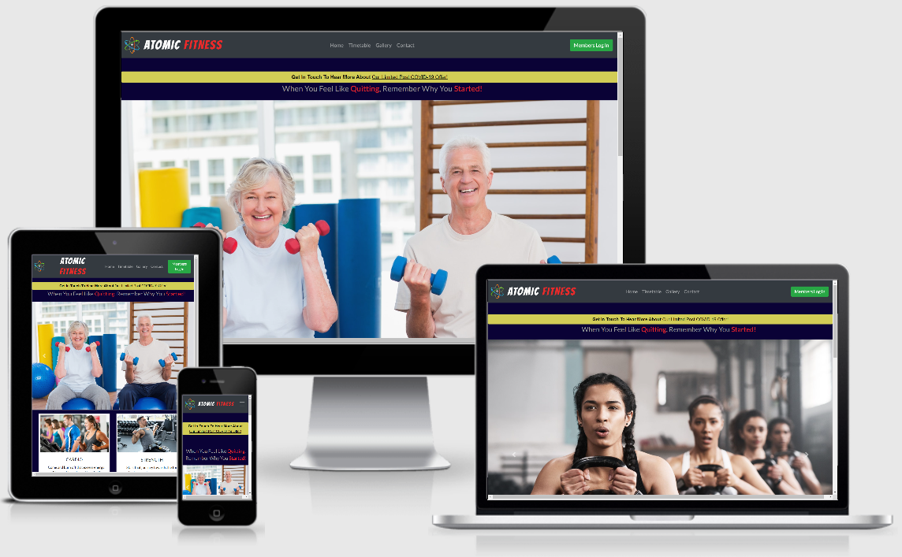

   

 ## ATOMIC FITNESS 

 *_NOTE: Atomic Fitness is fictious business set up for the Code Institute Mile Stone 1 project._*

   Atomic Fitness is a new high end gym and fitness centre established in the heart of the Dublin suburb of Carrickstown in 
   an effort to meet the growing demand for such an establishment amongst the young adults, families and senior citizens 
   within the locality.  The large selection of equipment and expansive floor space plus three spacious studios will ensure our
   guests come and enjoy a envigorating workout.

   ## User Experience (UX)

-   ### User Stories:
    
    1. Rebecca & Stephen - Made Enquiries To Disucss Membership Plans & Facilities
    
    "We contacted the gym via the details outlined on the "Contact Us" page on the website and the staff responded to our query 
    within an hour, was able to answer all our questions there and then.  Before we went down for our induction we reviewed the 
    facilities outlined on the Homepage to see if the gym had what we were looking for - and it did."

    2. The Murphy Family - Members and frequent visitors to the gym for the past six months
    
    "As we were new to the location, our family were looking for somewhere safe where we could bring the children to 
    release some of the energy they have built up during the week. My husband and I are able to plan our exercise thanks to the
    extensive Timetable set out on the website and also with the link attached to the Studio section on the homepage. We also
    get great use out of the studios for the Kidz Zones exercises over the weekend periods."
    
    3. Roger & Joan - Senior Members who tend to exercise at the gym during off peak periods.

    "Joan was on the internet a couple of months ago and came across Atomic Fitness. When she showed me the images on the Gallery
    page with other members similar to our age we were reassured we could go down to the gym and not be put off by the other members.
    We both make great use out of the studio classes and have made new friends with fellow members in the studio classes."

### Benefits

* User will be able to sign up in and register for classes using the call to action button on each page.
* The Timetable located on it's own page is colour coordinated for the benefit of the guests for ease of use when deciding what classes
to attend. In addition there is a link on the Studio Image on the landing page which will take the user directly to the Timetable page.

### Reasons For The Site

* To demonstrate to existing and potential new members the bright, spacious and clean facility that caters for every demographic.
* Easy to access and use for those that may not be technologically gifted.  The website is laid out in such a manner that they can
review the facilities, the timetable and a gallery of photographs demonstrating the enjoyment other members get out of the gym.

### Layout

* Neutral non-offensive colours on the background which draws out the contrast of the photographs nicely to give the impression of a 
bright, clean and friendly gym for all members.
* The typography is a standard font easy to read for all members and which does not overload the website, the content is kept to a minimum
so that members are not overloaded with details and information when deciding whether to join or not.

### Members & Potential Members

* The gym intends to target all members of the public to join so that it becomes an integral part of the community where new friendships 
can begin.  These include families with young children, young professionals and the senior community with the anticipation that classes
and facilities will be extended to cater for them in the form of ballroom dancing once a week - in the future.
    
## Design
 
### Color Scheme

The main colour used for the background on the website was a dark navy which drew a nice contrast against the images set 
out throughout the website. For the Footer, a maroon red was used which contrasted well with the main body color and highlighted
the content of the three areas of the Footer for the user.

### Typography

The predominant font on the website is Lato with Roboto as the nominated fallback font to ensure the site content will load correctly.
For the Atomic Fitness logo, I decided to use something a little different in the form of the "Bangers" font to draw the users eye to 
the menu bar and the members login icon.

### Imagery

The carousel designed on the homepage is specifically set up to draw the users attention that the facility is open to all age groups
in addition to the fact that the gym is a large open space suitable for many users to come and visit at once.  I also decided to inclue
a gallery in the site which is broken down in to images of Senior members, members wishing to use cardio equipment, the studio and the
machines for strength and conditioning.  When a users lands on the image gallery, they can click on each individual photos to enlarge them
to get a better view of what is on offer for members.

### Wireframes

[wireframes](https://github.com/colinflahive/MS1_Fitness/blob/master/assets/docs/Wireframes.pdf)

### Features

The Google developer tools facilities were used to ensure the website was responsive and loaded to alternative devices correctly.

There is a link to the Timetable embedded in to the text on the card for the Studio on the Homepage which will bring the user to the 
studio Timetable as an alternative to having to click on the Timetable menu option.

## Technologies Used

*   HTML5
*   CSS3
*   Bootstrap 4

### Frameworks | Libraries | Programs Used

*   Balsamiq
    + The Balsamiq software was used to draft my wireframe in order to get an outline of the website I was looking to draft.
    During the process it was referred to on a number of occasions in order to determine if any changes were to be made to the initial outlay.

*   GitHub    
    + GitHub was the preferred Integrated Development Environment (IDE) for this project was used used to store my code each
    time it there was a Git performed. 

    + Git was used for version control for this project when using GitHub Gitpod terminal to commit to Git and Push to GitHub. Clear 
    and concise descriptions were included at the Git Commit instruction in order for the user to identify what changes and amendments were
    made to the code in between Push instructions.
    *   GitHub    
    
*   Images 
    + Images were sourced from unsplash.com, pixabay.com and google/images.

*   Toolur
    + Toolur.com was used to resize and compress images which were included in the carousel on the Hompage along with the images
    on theGallery page of the website. Very convenient and easy to use.

*   JQuery
    + This was used with Bootstrap in order to make aspects of the website responsive on different devices.

*   Google Fonts
    + The Google Fonts library was used to select the font for the main body of the website along with something distinctive for the logo
    on the Navbar.

*   Bootstrap 4
    + Bootstrap was used extensively throughout the development of the website in order to assist with the layout which I was
    looking for.  There were slight modifications made to the templates used in order to finalise the styling I was looking for.

*   Fancyapps
    + Sourced on one of the forums on Slack and used experimentally for the carousel on the homepage.

### Testing

The W3C Markup Validator and W3C CSS Validator Services were used to validate each page to ensure there were no syntax errors in 
the project.

* [W3C HTML Validator](https://validator.w3.org/) - Used to test HTML code on the website. All outstanding errors cleared.
* [W3C CSS Validator](https://jigsaw.w3.org/css-validator/) - Used to test the CSS code on the website. All outstanding errors cleared.

### Further Testing

The website was tested on on Firefox, Internet Explorer, Google Chrome, Samsung Android phone and iPhone 11. A fellow student provided
feedback on the Peer-to-Peer review on Slack to advise that the content just overloaded slightly on the landing page on her device iPhone 6s,
however, when I went to review on DevTools/Responsive settings, I couldn't see any issue with the iPhone 6 device.

### TO NOTE

There was an issue with the responsiveness to smaller devices with the table on the Timetable page which didn't adjust to the way I wanted 
it to.  Having attempted to format it in a numer of different ways, I had to stop in order to submit my project on time. Should this issue 
arise in future projects, this will be noted and more effort will be placed in getting it right.

## Deployment

* [Atomic Fitness](https://colinflahive.github.io/MS1_Fitness/) website is hosted on the GitHub Integrated Development Environment (IDE)

## Credits
* Many thanks to all my fellow students on Slack who provided reassurance that MS1 was achievable, in particular Jim Morell 
(handle @Jim_Lynx_Lead).
* To my mentor Allen Thomas Varghese.
* And to the very helpful Code Institute tutors always at the other end of the keyboard who are there to assist in times of emergencies - thank you.

  

